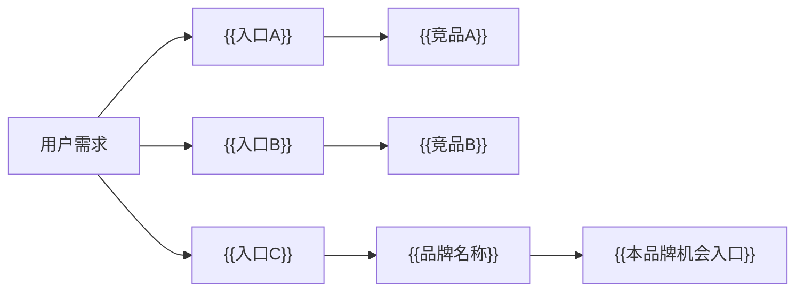
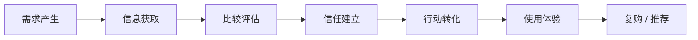
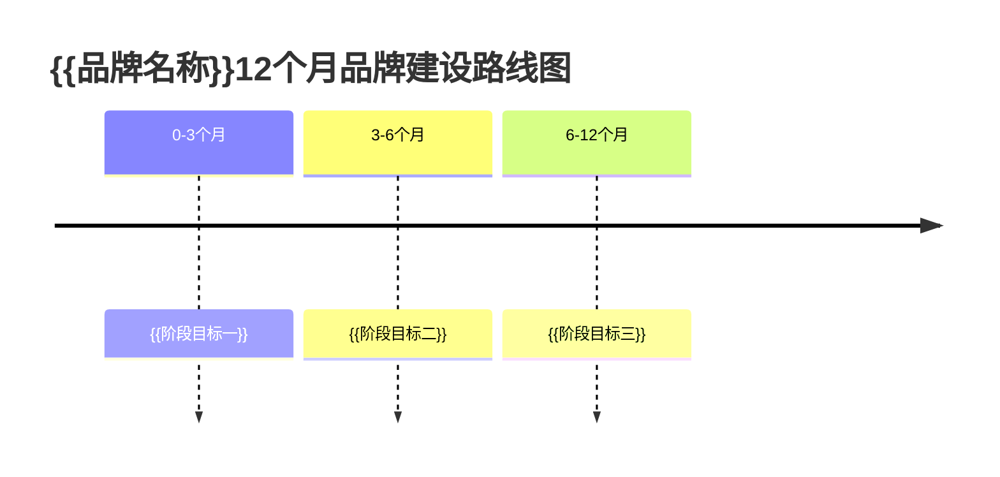

# 《{{品牌名称}}品牌诊断报告》

> 报告用途：{{诊断报告用途}}
>
> 报告深度：{{报告深度}}
>
> 生成日期：{{日期}}
>
> 说明：本模板用于生成咨询公司正式提案风格的品牌诊断报告。所有核心结论必须标注依据类型；无明确数据支持的判断必须标注为“待验证假设”。
>
> 视觉交付说明：本 Markdown 模板仅作为内容结构源。正式交付默认生成 HTML，请使用 `report-html-template.html` 与 `styles/html-report.css`，采用白背景、`#C8FF00` 荧光高亮、`#1A1A1A` 黑色文字、PingFang SC、Inter / Helvetica Neue。

## 0. 一页核心结论

### 0.1 核心诊断结论

<div class="diagnosis-conclusion">
{{用一段话说明品牌当前最核心的问题和机会。必须结论先行，避免只描述背景。}}
</div>

依据类型：{{公开数据 / 竞品观察 / 用户调研 / 业务数据 / 专家判断 / 待验证假设}}  
依据说明：{{简要说明该结论基于什么信息得出}}  
可信度：{{高 / 中 / 低}}  
是否需补充验证：{{是 / 否}}

### 0.2 诊断依据页

| 核心结论 | 依据类型 | 依据说明 | 可信度 | 是否需补充验证 |
|---|---|---|---|---|
| {{核心结论 1}} | {{依据类型}} | {{依据说明}} | {{高/中/低}} | {{是/否}} |
| {{核心结论 2}} | {{依据类型}} | {{依据说明}} | {{高/中/低}} | {{是/否}} |
| {{核心结论 3}} | {{依据类型}} | {{依据说明}} | {{高/中/低}} | {{是/否}} |
| {{核心结论 4}} | {{依据类型}} | {{依据说明}} | {{高/中/低}} | {{是/否}} |

### 0.3 关键问题与机会总览

| 类型 | 内容 | 优先级 | 依据类型 |
|---|---|---|---|
| 核心问题 | {{问题 1}} | {{P0/P1/P2}} | {{依据类型}} |
| 核心问题 | {{问题 2}} | {{P0/P1/P2}} | {{依据类型}} |
| 核心机会 | {{机会 1}} | {{P0/P1/P2}} | {{依据类型}} |
| 核心机会 | {{机会 2}} | {{P0/P1/P2}} | {{依据类型}} |

### 0.4 诊断总判断

- 品牌当前最大处境：{{判断}}。依据类型：{{依据类型}}
- 最大竞争压力：{{判断}}。依据类型：{{依据类型}}
- 最大用户机会：{{判断}}。依据类型：{{依据类型}}
- 最大品牌资产断点：{{判断}}。依据类型：{{依据类型}}
- 下一阶段最重要的升级方向：{{判断}}。依据类型：{{依据类型}}

## 1. 品牌当前处境

### 1.1 品牌发展阶段判断

| 判断维度 | 当前表现 | 诊断结论 | 依据类型 |
|---|---|---|---|
| 发展阶段 | {{启动期/增长期/成熟期/转型期/重塑期/延展期}} | {{诊断结论}} | {{依据类型}} |
| 业务动能 | {{当前表现}} | {{诊断结论}} | {{依据类型}} |
| 品牌认知 | {{当前表现}} | {{诊断结论}} | {{依据类型}} |
| 渠道入口 | {{当前表现}} | {{诊断结论}} | {{依据类型}} |
| 增长压力 | {{当前表现}} | {{诊断结论}} | {{依据类型}} |

### 1.2 当前业务目标与品牌任务

| 业务目标 | 品牌需要承担的任务 | 当前差距 | 依据类型 |
|---|---|---|---|
| {{业务目标}} | {{品牌任务}} | {{当前差距}} | {{依据类型}} |
| {{业务目标}} | {{品牌任务}} | {{当前差距}} | {{依据类型}} |

### 1.3 当前核心业务问题

在【{{行业变化 / 入口变化 / 用户需求变化 / 竞争加剧}}】的背景下，{{品牌名称}}如何从【{{当前品牌状态}}】升级为【{{目标品牌状态}}】，并解决【{{核心业务挑战}}】？

依据类型：{{依据类型}}  
依据说明：{{依据说明}}  
可信度：{{高/中/低}}  
是否需补充验证：{{是/否}}

### 1.4 初始诊断假设

| 假设 | 为什么提出该假设 | 需要通过什么分析验证 | 依据类型 |
|---|---|---|---|
| {{假设 1}} | {{原因}} | {{验证方式}} | {{依据类型}} |
| {{假设 2}} | {{原因}} | {{验证方式}} | {{依据类型}} |
| {{假设 3}} | {{原因}} | {{验证方式}} | {{依据类型}} |
| {{假设 4}} | {{原因}} | {{验证方式}} | {{依据类型}} |

### 1.5 本报告分析框架

| 分析维度 | 核心问题 | 输出结果 |
|---|---|---|
| 行业与入口变化 | {{行业竞争逻辑和用户入口如何变化}} | {{机会与风险}} |
| 竞品心智格局 | {{竞品占据什么心智}} | {{心智空位}} |
| 用户心智与场景洞察 | {{用户真正需要什么}} | {{场景与洞察}} |
| 品牌资产与断点 | {{品牌资产为何未转化}} | {{资产断点}} |
| 核心矛盾与战略机会 | {{真正要解决什么}} | {{战略机会}} |
| 品牌升级方向 | {{品牌应迁移到哪里}} | {{升级路径}} |
| 下一步验证与落地建议 | {{哪些判断需验证}} | {{验证清单}} |

## 2. 行业与入口变化

### 2.1 行业发展阶段判断

| 判断维度 | 当前表现 | 诊断结论 | 依据类型 |
|---|---|---|---|
| 行业阶段 | {{当前表现}} | {{诊断结论}} | {{依据类型}} |
| 增长来源 | {{当前表现}} | {{诊断结论}} | {{依据类型}} |
| 竞争密度 | {{当前表现}} | {{诊断结论}} | {{依据类型}} |
| 用户成熟度 | {{当前表现}} | {{诊断结论}} | {{依据类型}} |

### 2.2 行业竞争逻辑变化

| 过去竞争逻辑 | 当前竞争逻辑 | 对品牌的影响 | 依据类型 |
|---|---|---|---|
| {{过去逻辑}} | {{当前逻辑}} | {{影响}} | {{依据类型}} |
| {{过去逻辑}} | {{当前逻辑}} | {{影响}} | {{依据类型}} |

### 2.3 入口变化与流量分发变化

| 入口类型 | 用户行为变化 | 对品牌的机会 | 对品牌的威胁 | 依据类型 |
|---|---|---|---|---|
| {{入口类型}} | {{变化}} | {{机会}} | {{威胁}} | {{依据类型}} |
| {{入口类型}} | {{变化}} | {{机会}} | {{威胁}} | {{依据类型}} |
| {{入口类型}} | {{变化}} | {{机会}} | {{威胁}} | {{依据类型}} |

### 2.4 用户决策标准变化

| 用户过去看重 | 用户现在看重 | 变化原因 | 对品牌表达的启示 | 依据类型 |
|---|---|---|---|---|
| {{过去标准}} | {{当前标准}} | {{原因}} | {{启示}} | {{依据类型}} |
| {{过去标准}} | {{当前标准}} | {{原因}} | {{启示}} | {{依据类型}} |

### 2.5 行业关键成功因素

| 关键成功因素 | 说明 | 对本品牌的要求 | 依据类型 |
|---|---|---|---|
| {{因素}} | {{说明}} | {{要求}} | {{依据类型}} |
| {{因素}} | {{说明}} | {{要求}} | {{依据类型}} |
| {{因素}} | {{说明}} | {{要求}} | {{依据类型}} |

### 2.6 行业机会与风险

| 类型 | 具体内容 | 对品牌的启示 | 依据类型 |
|---|---|---|---|
| 行业机会 | {{内容}} | {{启示}} | {{依据类型}} |
| 行业机会 | {{内容}} | {{启示}} | {{依据类型}} |
| 行业风险 | {{内容}} | {{启示}} | {{依据类型}} |
| 行业风险 | {{内容}} | {{启示}} | {{依据类型}} |

### 2.7 对品牌的阶段性启示

| 结论 | 分析 | 对品牌的启示 | 依据类型 |
|---|---|---|---|
| {{结论}} | {{分析}} | {{启示}} | {{依据类型}} |
| {{结论}} | {{分析}} | {{启示}} | {{依据类型}} |
| {{结论}} | {{分析}} | {{启示}} | {{依据类型}} |

## 3. 竞品心智格局

### 3.1 竞品分类

| 类型 | 说明 | 代表品牌 / 方案 | 对本品牌的竞争压力 | 依据类型 |
|---|---|---|---|---|
| 直接竞品 | {{说明}} | {{代表品牌 / 方案}} | {{压力}} | {{依据类型}} |
| 间接竞品 | {{说明}} | {{代表品牌 / 方案}} | {{压力}} | {{依据类型}} |
| 替代方案 | {{说明}} | {{代表品牌 / 方案}} | {{压力}} | {{依据类型}} |

### 3.2 竞品心智占位图

| 竞品 | 用户心智 | 核心主张 | 核心优势 | 核心短板 | 对本品牌的压力 | 依据类型 |
|---|---|---|---|---|---|---|
| {{竞品}} | {{心智}} | {{主张}} | {{优势}} | {{短板}} | {{压力}} | {{依据类型}} |
| {{竞品}} | {{心智}} | {{主张}} | {{优势}} | {{短板}} | {{压力}} | {{依据类型}} |

### 3.3 竞品入口地图



入口地图说明：{{说明用户从哪些入口接触竞品、本品牌在哪些入口强/弱，以及入口之间是否存在分流或替代。}}

依据类型：{{依据类型}}

### 3.4 竞品内容与传播打法

| 竞品 | 内容主题 | 内容形式 | 传播主张 | 信任建立方式 | 对本品牌启示 | 依据类型 |
|---|---|---|---|---|---|---|
| {{竞品}} | {{主题}} | {{形式}} | {{主张}} | {{方式}} | {{启示}} | {{依据类型}} |
| {{竞品}} | {{主题}} | {{形式}} | {{主张}} | {{方式}} | {{启示}} | {{依据类型}} |

### 3.5 竞品转化链路对比

| 竞品 | 认知入口 | 兴趣激发方式 | 信任建立方式 | 转化动作 | 留存机制 | 链路优劣 | 依据类型 |
|---|---|---|---|---|---|---|---|
| {{竞品}} | {{入口}} | {{方式}} | {{方式}} | {{动作}} | {{机制}} | {{优劣}} | {{依据类型}} |
| {{竞品}} | {{入口}} | {{方式}} | {{方式}} | {{动作}} | {{机制}} | {{优劣}} | {{依据类型}} |

### 3.6 竞争心智空位

| 已被占据的心智 | 占据者 | 我方是否应避开 | 尚未被充分占据的心智 | 我方机会 | 依据类型 |
|---|---|---|---|---|---|
| {{心智}} | {{占据者}} | {{是/否}} | {{空位}} | {{机会}} | {{依据类型}} |
| {{心智}} | {{占据者}} | {{是/否}} | {{空位}} | {{机会}} | {{依据类型}} |

### 3.7 对本品牌的竞争启示

- 不应正面硬刚：{{内容}}。依据类型：{{依据类型}}
- 可以借鉴：{{内容}}。依据类型：{{依据类型}}
- 必须避开同质化表达：{{内容}}。依据类型：{{依据类型}}
- 最值得抢占的心智空位：{{内容}}。依据类型：{{依据类型}}

## 4. 用户心智与场景洞察

### 4.1 目标用户分层

| 用户类型 | 用户特征 | 核心需求 | 典型场景 | 当前解决方式 | 品牌机会 | 依据类型 |
|---|---|---|---|---|---|---|
| {{用户类型}} | {{特征}} | {{需求}} | {{场景}} | {{方式}} | {{机会}} | {{依据类型}} |
| {{用户类型}} | {{特征}} | {{需求}} | {{场景}} | {{方式}} | {{机会}} | {{依据类型}} |

### 4.2 用户心智现状

| 用户当前如何理解本品牌 | 形成原因 | 对品牌的影响 | 依据类型 |
|---|---|---|---|
| {{用户心智}} | {{原因}} | {{影响}} | {{依据类型}} |
| {{用户心智}} | {{原因}} | {{影响}} | {{依据类型}} |

### 4.3 用户需求层级

| 层级 | 用户需求 | 对品牌表达的启示 | 依据类型 |
|---|---|---|---|
| 表层需求 | {{需求}} | {{启示}} | {{依据类型}} |
| 功能需求 | {{需求}} | {{启示}} | {{依据类型}} |
| 情绪需求 | {{需求}} | {{启示}} | {{依据类型}} |
| 深层动机 | {{需求}} | {{启示}} | {{依据类型}} |

### 4.4 用户场景链路图



场景链路说明：{{根据行业动态说明用户从需求产生到任务完成的完整链路。若涉及走出去/出门/生活服务/旅行/线下消费/出行，则改写为对应“走出去场景链路图”。}}

依据类型：{{依据类型}}

### 4.5 用户决策链路

| 阶段 | 用户行为 | 用户关注点 | 用户顾虑 | 品牌应做什么 | 依据类型 |
|---|---|---|---|---|---|
| 需求产生 | {{行为}} | {{关注点}} | {{顾虑}} | {{动作}} | {{依据类型}} |
| 信息获取 | {{行为}} | {{关注点}} | {{顾虑}} | {{动作}} | {{依据类型}} |
| 比较评估 | {{行为}} | {{关注点}} | {{顾虑}} | {{动作}} | {{依据类型}} |
| 信任建立 | {{行为}} | {{关注点}} | {{顾虑}} | {{动作}} | {{依据类型}} |
| 行动转化 | {{行为}} | {{关注点}} | {{顾虑}} | {{动作}} | {{依据类型}} |
| 使用体验 | {{行为}} | {{关注点}} | {{顾虑}} | {{动作}} | {{依据类型}} |
| 复购 / 推荐 | {{行为}} | {{关注点}} | {{顾虑}} | {{动作}} | {{依据类型}} |

### 4.6 用户痛点与顾虑

| 类型 | 具体痛点 / 顾虑 | 产生原因 | 品牌应对方式 | 依据类型 |
|---|---|---|---|---|
| 显性痛点 | {{内容}} | {{原因}} | {{方式}} | {{依据类型}} |
| 隐性痛点 | {{内容}} | {{原因}} | {{方式}} | {{依据类型}} |
| 功能顾虑 | {{内容}} | {{原因}} | {{方式}} | {{依据类型}} |
| 情绪顾虑 | {{内容}} | {{原因}} | {{方式}} | {{依据类型}} |
| 信任顾虑 | {{内容}} | {{原因}} | {{方式}} | {{依据类型}} |
| 价格顾虑 | {{内容}} | {{原因}} | {{方式}} | {{依据类型}} |
| 服务顾虑 | {{内容}} | {{原因}} | {{方式}} | {{依据类型}} |
| 决策顾虑 | {{内容}} | {{原因}} | {{方式}} | {{依据类型}} |

### 4.7 核心用户洞察

| 表层观察 | 深层动机 | 对品牌表达的启示 | 依据类型 | 是否待验证 |
|---|---|---|---|---|
| {{观察}} | {{动机}} | {{启示}} | {{依据类型}} | {{是/否}} |
| {{观察}} | {{动机}} | {{启示}} | {{依据类型}} | {{是/否}} |
| {{观察}} | {{动机}} | {{启示}} | {{依据类型}} | {{是/否}} |

## 5. {{品牌名称}}品牌资产与断点

### 5.1 品牌认知诊断

| 维度 | 当前表现 | 主要问题 | 影响 | 优先级 | 依据类型 |
|---|---|---|---|---|---|
| 知名度 | {{表现}} | {{问题}} | {{影响}} | {{优先级}} | {{依据类型}} |
| 理解度 | {{表现}} | {{问题}} | {{影响}} | {{优先级}} | {{依据类型}} |
| 心智清晰度 | {{表现}} | {{问题}} | {{影响}} | {{优先级}} | {{依据类型}} |

### 5.2 品牌定位诊断

| 诊断项 | 当前判断 | 优势 | 短板 | 优化方向 | 依据类型 |
|---|---|---|---|---|---|
| 目标用户 | {{判断}} | {{优势}} | {{短板}} | {{方向}} | {{依据类型}} |
| 差异化 | {{判断}} | {{优势}} | {{短板}} | {{方向}} | {{依据类型}} |
| 延展性 | {{判断}} | {{优势}} | {{短板}} | {{方向}} | {{依据类型}} |

### 5.3 品牌主张诊断

| 当前主张 / 表达 | 优势 | 短板 | 优化方向 | 依据类型 |
|---|---|---|---|---|
| {{主张}} | {{优势}} | {{短板}} | {{方向}} | {{依据类型}} |

### 5.4 品牌资产盘点

| 资产类型 | 当前资产 | 用户是否感知 | 价值判断 | 是否可复用 | 是否需要补强 | 依据类型 |
|---|---|---|---|---|---|---|
| 品牌名称 | {{资产}} | {{是/否/待验证}} | {{判断}} | {{是/否}} | {{建议}} | {{依据类型}} |
| 品牌符号 | {{资产}} | {{是/否/待验证}} | {{判断}} | {{是/否}} | {{建议}} | {{依据类型}} |
| 品牌视觉 | {{资产}} | {{是/否/待验证}} | {{判断}} | {{是/否}} | {{建议}} | {{依据类型}} |
| 品牌口号 | {{资产}} | {{是/否/待验证}} | {{判断}} | {{是/否}} | {{建议}} | {{依据类型}} |
| 产品能力 | {{资产}} | {{是/否/待验证}} | {{判断}} | {{是/否}} | {{建议}} | {{依据类型}} |
| 技术能力 | {{资产}} | {{是/否/待验证}} | {{判断}} | {{是/否}} | {{建议}} | {{依据类型}} |
| 服务能力 | {{资产}} | {{是/否/待验证}} | {{判断}} | {{是/否}} | {{建议}} | {{依据类型}} |
| 生态能力 | {{资产}} | {{是/否/待验证}} | {{判断}} | {{是/否}} | {{建议}} | {{依据类型}} |
| 用户口碑 | {{资产}} | {{是/否/待验证}} | {{判断}} | {{是/否}} | {{建议}} | {{依据类型}} |
| 媒体背书 | {{资产}} | {{是/否/待验证}} | {{判断}} | {{是/否}} | {{建议}} | {{依据类型}} |
| 数据背书 | {{资产}} | {{是/否/待验证}} | {{判断}} | {{是/否}} | {{建议}} | {{依据类型}} |
| 会员资产 | {{资产}} | {{是/否/待验证}} | {{判断}} | {{是/否}} | {{建议}} | {{依据类型}} |
| 私域资产 | {{资产}} | {{是/否/待验证}} | {{判断}} | {{是/否}} | {{建议}} | {{依据类型}} |
| 内容资产 | {{资产}} | {{是/否/待验证}} | {{判断}} | {{是/否}} | {{建议}} | {{依据类型}} |
| 案例资产 | {{资产}} | {{是/否/待验证}} | {{判断}} | {{是/否}} | {{建议}} | {{依据类型}} |
| 场景资产 | {{资产}} | {{是/否/待验证}} | {{判断}} | {{是/否}} | {{建议}} | {{依据类型}} |

### 5.5 品牌断点诊断

| 断点类型 | 具体表现 | 产生原因 | 对业务的影响 | 优先级 | 依据类型 |
|---|---|---|---|---|---|
| 心智断点 | {{表现}} | {{原因}} | {{影响}} | {{优先级}} | {{依据类型}} |
| 场景断点 | {{表现}} | {{原因}} | {{影响}} | {{优先级}} | {{依据类型}} |
| 信任断点 | {{表现}} | {{原因}} | {{影响}} | {{优先级}} | {{依据类型}} |
| 内容断点 | {{表现}} | {{原因}} | {{影响}} | {{优先级}} | {{依据类型}} |
| 渠道断点 | {{表现}} | {{原因}} | {{影响}} | {{优先级}} | {{依据类型}} |
| 转化断点 | {{表现}} | {{原因}} | {{影响}} | {{优先级}} | {{依据类型}} |
| 会员 / 生态断点 | {{表现}} | {{原因}} | {{影响}} | {{优先级}} | {{依据类型}} |
| 组织协同断点 | {{表现}} | {{原因}} | {{影响}} | {{优先级}} | {{依据类型}} |

### 5.6 转化链路诊断

| 链路阶段 | 当前动作 | 用户阻力 | 断点判断 | 优化方向 | 依据类型 |
|---|---|---|---|---|---|
| 认知 | {{动作}} | {{阻力}} | {{判断}} | {{方向}} | {{依据类型}} |
| 兴趣 | {{动作}} | {{阻力}} | {{判断}} | {{方向}} | {{依据类型}} |
| 信任 | {{动作}} | {{阻力}} | {{判断}} | {{方向}} | {{依据类型}} |
| 行动 | {{动作}} | {{阻力}} | {{判断}} | {{方向}} | {{依据类型}} |
| 复购 / 推荐 | {{动作}} | {{阻力}} | {{判断}} | {{方向}} | {{依据类型}} |

### 5.7 品牌当前位置评分

| 诊断维度 | 分数 | 当前表现 | 主要问题 | 优先级 | 依据类型 |
|---|---:|---|---|---|---|
| 品牌认知 | {{1-5}} | {{表现}} | {{问题}} | {{优先级}} | {{依据类型}} |
| 品牌定位 | {{1-5}} | {{表现}} | {{问题}} | {{优先级}} | {{依据类型}} |
| 品牌主张 | {{1-5}} | {{表现}} | {{问题}} | {{优先级}} | {{依据类型}} |
| 品牌资产 | {{1-5}} | {{表现}} | {{问题}} | {{优先级}} | {{依据类型}} |
| 内容资产 | {{1-5}} | {{表现}} | {{问题}} | {{优先级}} | {{依据类型}} |
| 渠道效率 | {{1-5}} | {{表现}} | {{问题}} | {{优先级}} | {{依据类型}} |
| 信任资产 | {{1-5}} | {{表现}} | {{问题}} | {{优先级}} | {{依据类型}} |
| 转化链路 | {{1-5}} | {{表现}} | {{问题}} | {{优先级}} | {{依据类型}} |
| 组织资源 | {{1-5}} | {{表现}} | {{问题}} | {{优先级}} | {{依据类型}} |

## 6. 核心矛盾与战略机会

### 6.1 品牌问题金字塔

```text
品牌当前最大矛盾：{{最大矛盾}}
└── 第一层：表面问题
    └── {{表面问题}}
        └── 第二层：直接原因
            └── {{直接原因}}
                └── 第三层：深层根因
                    └── {{深层根因}}
                        └── 第四层：战略命题
                            └── {{战略命题}}
```

依据类型：{{依据类型}}

### 6.2 核心问题清单

| 核心问题 | 具体表现 | 背后原因 | 影响 | 优先级 | 依据类型 |
|---|---|---|---|---|---|
| {{问题}} | {{表现}} | {{原因}} | {{影响}} | {{优先级}} | {{依据类型}} |
| {{问题}} | {{表现}} | {{原因}} | {{影响}} | {{优先级}} | {{依据类型}} |
| {{问题}} | {{表现}} | {{原因}} | {{影响}} | {{优先级}} | {{依据类型}} |

### 6.3 核心矛盾总结

{{品牌名称}}当前并非只是【{{表面问题}}】，而是【{{深层问题}}】。因此，后续策略不应只【{{错误动作}}】，而应优先【{{正确方向}}】。

依据类型：{{依据类型}}  
依据说明：{{依据说明}}  
可信度：{{高/中/低}}  
是否需补充验证：{{是/否}}

### 6.4 战略机会清单

| 战略机会 | 机会来源 | 用户价值 | 竞争意义 | 优先级 | 依据类型 |
|---|---|---|---|---|---|
| {{机会}} | {{来源}} | {{用户价值}} | {{竞争意义}} | {{优先级}} | {{依据类型}} |
| {{机会}} | {{来源}} | {{用户价值}} | {{竞争意义}} | {{优先级}} | {{依据类型}} |

### 6.5 机会优先级矩阵

| 机会 | 机会价值 | 落地难度 | 资源要求 | 长期资产价值 | 优先级 |
|---|---|---|---|---|---|
| {{机会}} | {{高/中/低}} | {{高/中/低}} | {{高/中/低}} | {{高/中/低}} | {{P0/P1/P2}} |
| {{机会}} | {{高/中/低}} | {{高/中/低}} | {{高/中/低}} | {{高/中/低}} | {{P0/P1/P2}} |

### 6.6 反方论证

| 关键机会 / 判断 | 反方质疑 | 质疑是否成立 | 需要验证的数据 | 应对方式 |
|---|---|---|---|---|
| {{判断 1}} | {{反方问题}} | {{成立/部分成立/不成立}} | {{数据}} | {{应对}} |
| {{判断 2}} | {{反方问题}} | {{成立/部分成立/不成立}} | {{数据}} | {{应对}} |
| {{判断 3}} | {{反方问题}} | {{成立/部分成立/不成立}} | {{数据}} | {{应对}} |
| {{判断 4}} | {{反方问题}} | {{成立/部分成立/不成立}} | {{数据}} | {{应对}} |
| {{判断 5}} | {{反方问题}} | {{成立/部分成立/不成立}} | {{数据}} | {{应对}} |

### 6.7 反方论证后的修正判断

| 原判断 | 修正后判断 | 修正原因 | 后续验证方式 |
|---|---|---|---|
| {{原判断}} | {{修正后判断}} | {{原因}} | {{验证方式}} |
| {{原判断}} | {{修正后判断}} | {{原因}} | {{验证方式}} |

## 7. 品牌升级方向

### 7.1 品牌心智迁移图

```text
当前心智：{{当前用户如何理解品牌}}
        ↓
过渡心智：{{短中期需要建立的新理解}}
        ↓
目标心智：{{长期希望占据的位置}}
```

为什么当前心智需要迁移：{{原因}}  
迁移过程中要保留什么资产：{{资产}}  
要新增什么价值：{{价值}}  
要避免什么误区：{{误区}}  
依据类型：{{依据类型}}

### 7.2 本品牌当前位置到目标位置迁移图

| 坐标轴 | 当前所在位置 | 目标位置 | 迁移理由 |
|---|---|---|---|
| {{坐标轴}} | {{当前位置}} | {{目标位置}} | {{理由}} |
| {{坐标轴}} | {{当前位置}} | {{目标位置}} | {{理由}} |

```text
当前位置：{{当前位置}}
        → 迁移路径：{{迁移路径}}
目标位置：{{目标位置}}
```

### 7.3 品牌升级方向建议

| 方向 | 核心定义 | 用户价值 | 竞争意义 | 风险 | 推荐程度 |
|---|---|---|---|---|---|
| 方向一：{{方向}} | {{定义}} | {{价值}} | {{意义}} | {{风险}} | {{高/中/低}} |
| 方向二：{{方向}} | {{定义}} | {{价值}} | {{意义}} | {{风险}} | {{高/中/低}} |
| 方向三：{{方向}} | {{定义}} | {{价值}} | {{意义}} | {{风险}} | {{高/中/低}} |

### 7.4 推荐方向

- 推荐方向：{{推荐方向}}
- 为什么推荐：{{原因}}
- 承接了哪些品牌资产：{{资产}}
- 解决了哪些核心问题：{{问题}}
- 规避了哪些竞争风险：{{风险}}
- 需要补充验证什么：{{验证内容}}
- 依据类型：{{依据类型}}

### 7.5 12 个月品牌建设路线图

| 阶段 | 时间 | 核心目标 | 关键动作 | 关键产出 | 验证指标 |
|---|---|---|---|---|---|
| 第一阶段 | 0-3 个月 | {{目标}} | {{动作}} | {{产出}} | {{指标}} |
| 第二阶段 | 3-6 个月 | {{目标}} | {{动作}} | {{产出}} | {{指标}} |
| 第三阶段 | 6-12 个月 | {{目标}} | {{动作}} | {{产出}} | {{指标}} |



## 8. 下一步验证与落地建议

### 8.1 待验证假设清单

| 待验证假设 | 为什么重要 | 验证方式 | 所需数据 | 优先级 |
|---|---|---|---|---|
| {{假设}} | {{原因}} | {{方式}} | {{数据}} | {{优先级}} |
| {{假设}} | {{原因}} | {{方式}} | {{数据}} | {{优先级}} |

### 8.2 数据补充清单

| 数据类型 | 具体数据 | 用途 | 获取方式 |
|---|---|---|---|
| 公开数据 | {{数据}} | {{用途}} | {{方式}} |
| 竞品数据 | {{数据}} | {{用途}} | {{方式}} |
| 用户调研数据 | {{数据}} | {{用途}} | {{方式}} |
| 业务数据 | {{数据}} | {{用途}} | {{方式}} |
| 渠道数据 | {{数据}} | {{用途}} | {{方式}} |
| 内容数据 | {{数据}} | {{用途}} | {{方式}} |
| 转化数据 | {{数据}} | {{用途}} | {{方式}} |
| 会员 / 复购数据 | {{数据}} | {{用途}} | {{方式}} |
| 品牌认知数据 | {{数据}} | {{用途}} | {{方式}} |
| 用户满意度数据 | {{数据}} | {{用途}} | {{方式}} |

### 8.3 用户调研建议

| 调研对象 | 核心问题 | 推荐方式 | 预期验证内容 |
|---|---|---|---|
| {{对象}} | {{问题}} | {{方式}} | {{内容}} |
| {{对象}} | {{问题}} | {{方式}} | {{内容}} |

### 8.4 小规模验证动作

| 验证动作 | 验证目标 | 执行方式 | 成功标准 |
|---|---|---|---|
| {{动作}} | {{目标}} | {{方式}} | {{标准}} |
| {{动作}} | {{目标}} | {{方式}} | {{标准}} |

### 8.5 后续进入品牌战略层的输入

| 诊断输出 | 如何输入品牌战略层 |
|---|---|
| 核心矛盾 | {{输入方式}} |
| 目标心智 | {{输入方式}} |
| 差异化机会 | {{输入方式}} |
| 用户核心洞察 | {{输入方式}} |
| 品牌资产断点 | {{输入方式}} |
| 反方论证后的修正判断 | {{输入方式}} |
| 待验证假设 | {{输入方式}} |

## 9. 附录

### 9.1 分析框架说明

- 行业阶段判断
- 竞品心智分析
- 用户需求层级
- 用户决策链路
- 品牌资产盘点
- 品牌断点诊断
- 问题金字塔
- 机会优先级矩阵
- 反方论证
- 品牌心智迁移模型
- 12 个月品牌建设路线图

### 9.2 观点重复检查

| 高频观点 | 主要展开章节 | 其他章节是否重复 | 去重处理 |
|---|---|---|---|
| 品牌心智问题 | {{章节}} | {{是/否}} | {{处理方式}} |
| 入口变化 / 入口分流问题 | {{章节}} | {{是/否}} | {{处理方式}} |
| 新业务信任问题 | {{章节}} | {{是/否}} | {{处理方式}} |
| 用户场景延展问题 | {{章节}} | {{是/否}} | {{处理方式}} |
| 竞品心智压力 | {{章节}} | {{是/否}} | {{处理方式}} |
| 品牌资产断点 | {{章节}} | {{是/否}} | {{处理方式}} |
| 会员 / 生态 / 服务闭环机会 | {{章节}} | {{是/否}} | {{处理方式}} |
| 品牌升级方向 | {{章节}} | {{是/否}} | {{处理方式}} |

### 9.3 报告生成注意事项

- 信息不足处标注“待验证假设”。
- 不编造具体数据。
- 不把专家判断写成事实。
- 不重复表达同一观点。
- 每个核心结论必须标注依据类型。
- 反方论证必须真实挑战报告判断。
- 不输出简历相关内容。
